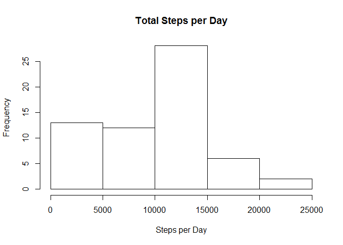
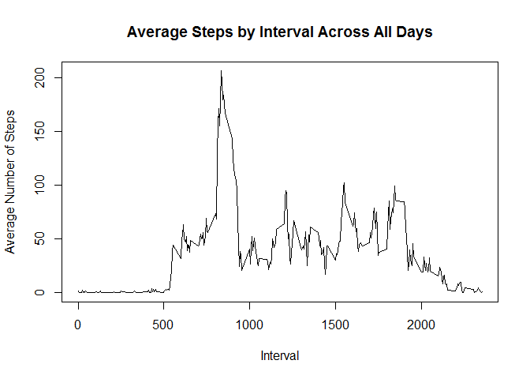
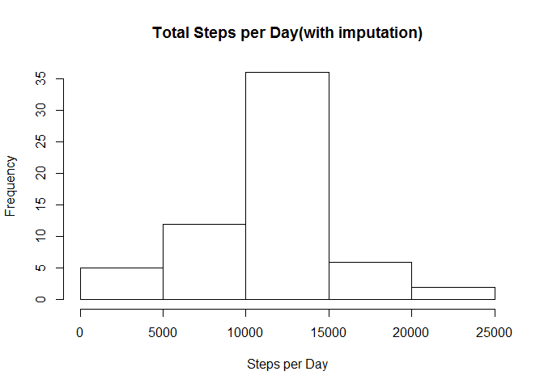
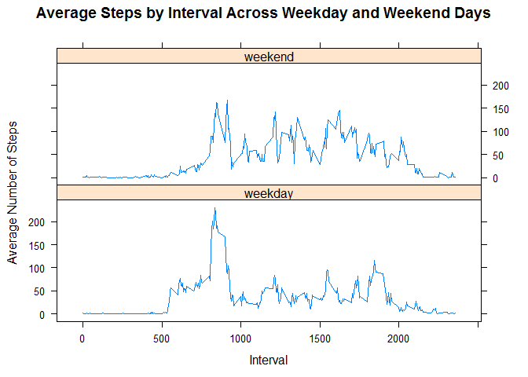

# Reproducible Research: Peer Assessment 1

## Loading and preprocessing the data
#### Required packages (messages and warnings are suppressed) and global Chunk options

```r
require(knitr)
require(dplyr)
require(lattice)
opts_chunk$set(fig.path = "figure/", echo = TRUE)
```
#### Read the data from the CSV file

```r
data <- read.csv(unz("C:/Users/jhunnings/Desktop/Reading/Coursera/git/RepData_PeerAssessment1/activity.zip",
                     "activity.csv"), stringsAsFactors = F)
```


## What is mean total number of steps taken per day?

```r
# Calculate total steps taken by day
data_spd <- group_by(data, date) %>%
  summarize(totalSteps = sum(steps, na.rm = T))

# Make a histogram of the total steps taken each day
hist(data_spd$totalSteps, main = "Total Steps per Day", xlab = "Steps per Day")
```



```r
# Calculate mean and median total steps
meanTotalSteps <- mean(data_spd$totalSteps, na.rm = T)
medianTotalSteps <- median(data_spd$totalSteps, na.rm = T)
```
The mean number of steps per day is: 9,354.23  
The median number of steps per day is: 10,395


## What is the average daily activity pattern?

```r
# Calculate average steps taken by interval across all days
data_aspi <- group_by(data, interval) %>%
  summarize(averageSteps = mean(steps, na.rm = T))

# Make a time series plot of the average steps by interval across all days
plot(x = data_aspi$interval, y = data_aspi$averageSteps, type = "l", xlab = "Interval",
     ylab = "Average Number of Steps",
     main = "Average Steps by Interval Across All Days")
```



```r
# Calculate which 5-minute interval, on average across all the days in the dataset, contains the maximum number of steps
maxAvgInterval <- data_aspi$interval[which.max(data_aspi$averageSteps)]
```
The 5-minute interval, on average across all the days in the dataset, containing the maximum number of steps is: 835


## Imputing missing values

```r
# Calculate total number of missing values in the dataset
totalMissing <- sum(is.na(data$steps))

# Fill in missing values with the mean for the interval
data_imp <- data
for(i in which(is.na(data_imp$steps)))  {
  data_imp$steps[i] <- data_aspi$averageSteps[data_aspi$interval == data_imp$interval[i]]
}

# Calculate total steps taken by day
data_spd <- group_by(data_imp, date) %>%
  summarize(totalSteps = sum(steps))

# Make a histogram of the total steps taken each day
hist(data_spd$totalSteps, main = "Total Steps per Day(with imputation)", xlab = "Steps per Day")
```



```r
# Calculate mean and median total steps
meanTotalSteps <- mean(data_spd$totalSteps)
medianTotalSteps <- median(data_spd$totalSteps)
```
The total number of missing values in the dataset is: 2,304  
With imputation the mean number of steps per day is: 10,766.19  
With imputation the median number of steps per day is: 10,766.19


## Are there differences in activity patterns between weekdays and weekends?

```r
# Start with imputed dataset and add a factor variable for weekdays and weekends
data_imp$timeOfWeek <- factor(ifelse(weekdays(as.Date(data_imp$date)) %in% c("Saturday", "Sunday"), 1, 0), 
                              labels = c("weekday", "weekend"))

# Calculate average steps taken by interval across all weekday and weekend days
data_waspi <- group_by(data_imp, interval, timeOfWeek) %>%
  summarize(averageSteps = mean(steps))

# Make a panel plot of the data
xyplot(averageSteps ~ interval | timeOfWeek, data_waspi, type = "l", xlab = "Interval",
       ylab = "Average Number of Steps",
       main = "Average Steps by Interval Across Weekday and Weekend Days", layout = c(1,2))
```


